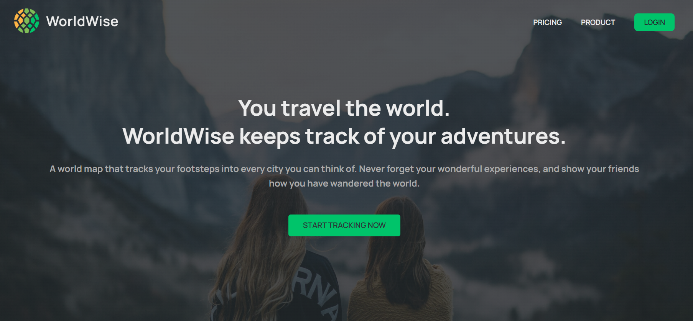
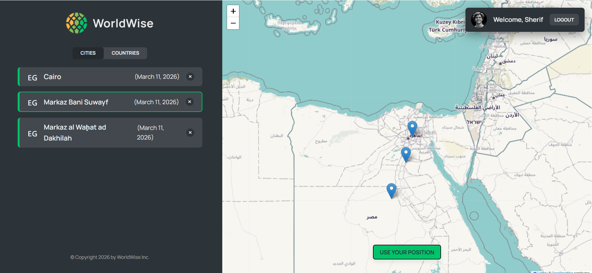
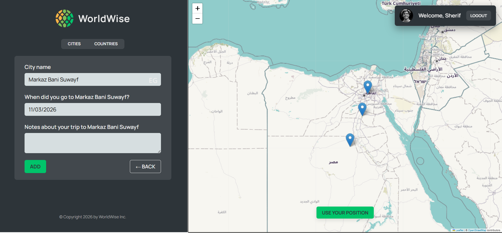

# 🌍 WorldWise

WorldWise is a modern **React application** that allows users to track the cities they have visited around the world.  
The app provides an interactive map where users can add locations, view city details, and manage their travel history.

This project was built to practice modern React development including **routing, state management, and component architecture**.

---

## 🚀 Features

- 🌎 Interactive world map
- 📍 Add cities you have visited
- 🗂 View detailed information about each city
- 🔄 Navigation using React Router
- 🧠 Global state management with Context API
- ⚡ Fast development using Vite
- 📱 Responsive user interface

---

## 🛠 Tech Stack

- React
- React Router
- Context API
- JavaScript (ES6+)
- CSS
- Vite

---

## 📸 Screenshots

Create a folder called **screenshots** in the project root and add images.

```markdown





```

---

## ⚙️ Installation

Clone the repository:
git clone https://github.com/yourusername/worldwise-react-app.git

Navigate to the project folder:
cd worldwise-react-app

Install dependencies:
npm install

Run the development server:
npm run dev

Open in your browser:
http://localhost:5173

---

## ⭐ Support

If you like this project, consider giving it a star ⭐ on GitHub.
